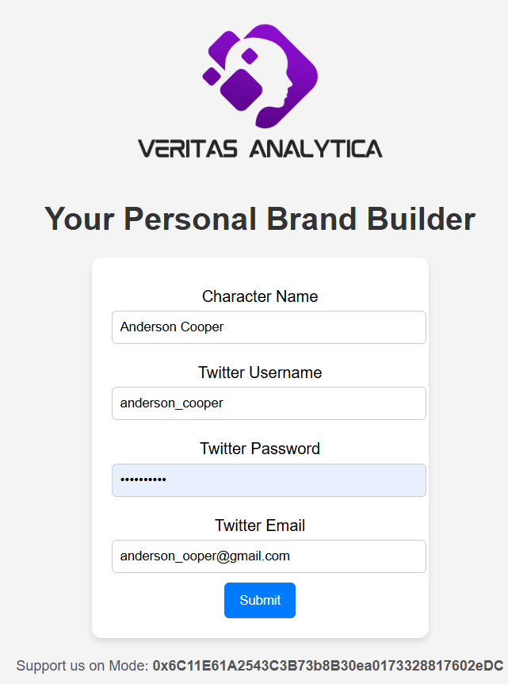
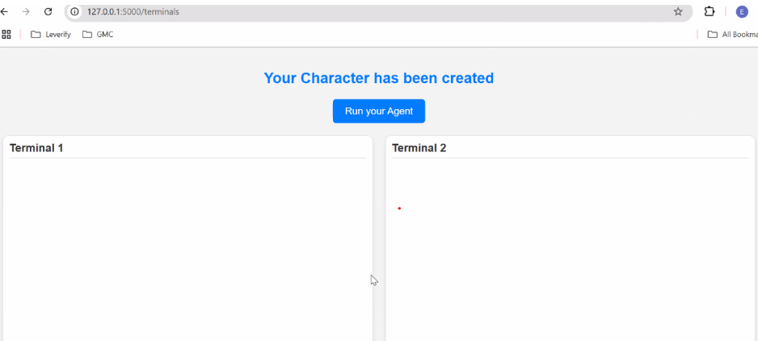
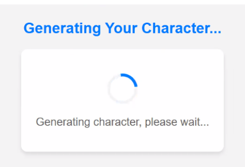

# Pulse Persona: AI-Powered Personal Branding Builder on Twitter
## Objective:
Idea is to have an AI agent to enhance a  personal brand by automating content recommendations, scheduling, interaction, and analysis on Twitter.
## Features of Pulse Persona:
- **Character File Generation:** Creates a profile that matches your unique style and personality for consistent messaging.
- **Content Generation:** Generates content tailored to your character and brand.
- **Post Scheduling:** Schedules posts automatically for the best times to maximize engagement.
- **Engagement:** Engages with others by liking, commenting, and interacting to keep you active and connected.
## Instructions on how to test the agent:
- Clone the repository.
```bash
git cline https://github.com/Veritas-Analytica/Pulse-Persona.git
```
- Install dependencies:
    1. Node.js 23+
    2. pnpm 9+
    3. Git for version control
    4. A code editor (VS Code or VSCodium recommended)
- Build the project by running the following commands:
```bash
pnpm install --no-frozen-lockfile
pnpm build
```
- In the **_.env_** file, add your OpenAI API key and Twitter credentials.
- Install the following libraries:
```bash
pip install flask
pip install pyyaml
pip install openai
pip install flask-socketio
```
- Now, run **_app.py_**, and you will see the following screen. In the character section, please identify the character you want to build a brand for. Also, provide the Twitter credentials for the account you want to post on.

- Please click on "Submit," and it will begin generating your character file.

- Once your character has been generated, it will start posting, scheduling, and engaging on your behalf based on the data from your character file.
